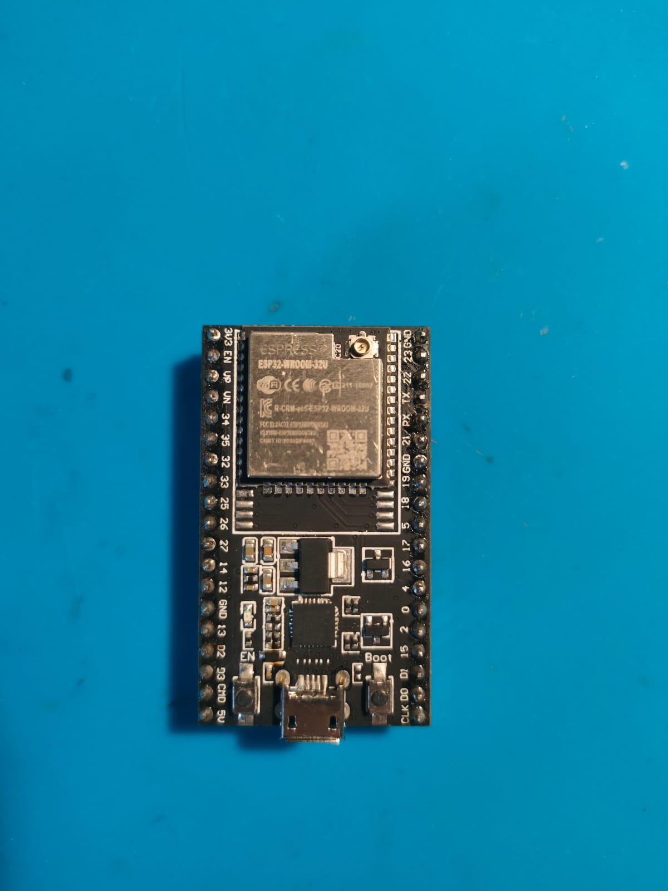
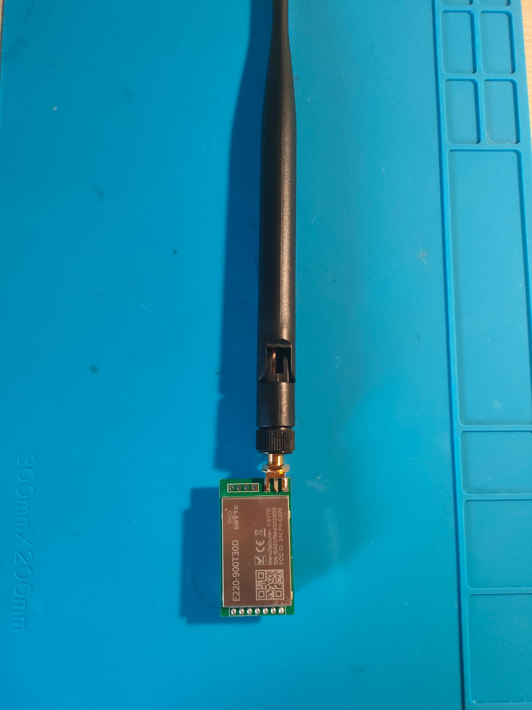
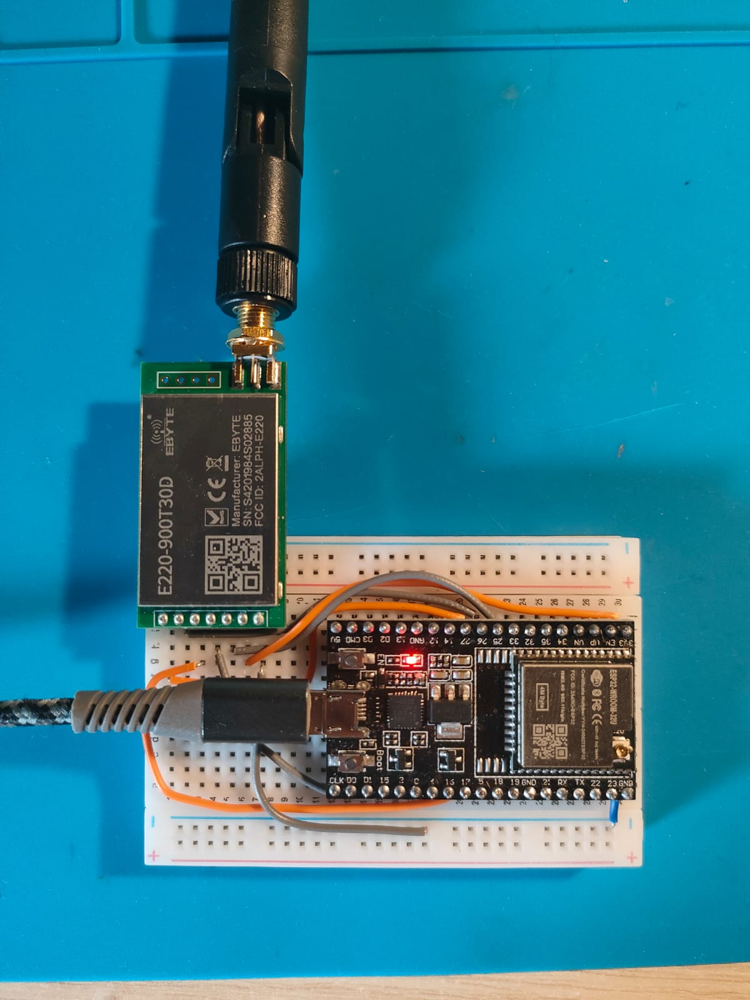

# LoRa E220 Wireless Chat System
## Sistema di Comunicazione Chat Wireless a Lungo Raggio

### 📡 Panoramica del Progetto

Il **LoRa E220 Wireless Chat System** è un sistema di comunicazione wireless che utilizza moduli LoRa E220-900T30D per creare una rete di chat a lungo raggio. Questo sistema permette la comunicazione bidirezionale tra dispositivi ESP32 attraverso la tecnologia LoRa, offrendo portate fino a diversi chilometri in campo aperto.

### 🎯 Caratteristiche Principali

- **Comunicazione a Lungo Raggio**: Utilizza tecnologia LoRa per comunicazioni fino a 5-10 km in campo aperto
- **Chat Multi-Utente**: Supporta comunicazioni punto-a-punto e broadcast  
- **Configurazione Flessibile**: Impostazioni personalizzabili per indirizzo, canale, potenza e velocità
- **Persistenza Dati**: Salvataggio automatico delle configurazioni in EEPROM
- **Interfaccia Seriale Interattiva**: Menu intuitivo per tutte le operazioni
- **Modalità Chat in Tempo Reale**: Sistema di chat continuo con ricezione automatica
- **Identificazione Mittente**: Ogni messaggio include l'ID del dispositivo mittente
- **Indicatore RSSI**: Visualizzazione della potenza del segnale ricevuto

### 🔧 Hardware Richiesto

#### Componenti Necessari
- **ESP32 WROOM-32D** o **ESP32 WROOM-32U** Development Board (1x per dispositivo)
- **Modulo LoRa E220-900T30D** (1x per dispositivo) - Potenza massima 30 dBm
- **Breadboard** per prototipazione
- **Cavi Jumper** per connessioni
- **Antenna 5dBi 19cm** (1x per dispositivo)
- **Alimentazione USB** per ESP32

#### Immagini Hardware


*ESP32 WROOM-32D Development Board*


*Modulo LoRa E220-900T30D*


*Configurazione su Breadboard con collegamenti*

#### Schema di Connessione ESP32 ↔ E220-900T30D

| ESP32 Pin | E220-900T30D Pin | Descrizione |
|-----------|------------------|-------------|
| GPIO 17   | RX               | Trasmissione dati ESP32 → E220 |
| GPIO 16   | TX               | Ricezione dati E220 → ESP32 |
| GPIO 27   | M0               | Controllo modalità operativa |
| GPIO 26   | M1               | Controllo modalità operativa |
| GPIO 25   | AUX              | Stato del modulo |
| 3.3V      | VCC              | Alimentazione |
| GND       | GND              | Terra |

### 💾 Installazione Software

#### Librerie Arduino Richieste
```cpp
// Installare tramite Library Manager di Arduino IDE:
#include <LoRa_E220.h>           // EByte_LoRa_E220_Series_Library
#include <EEPROM.h>              // Inclusa in ESP32 Core
```

#### Configurazione Arduino IDE
1. Installare il supporto per ESP32 nel Gestore Schede
2. Selezionare: **ESP32 WROOM-32** o equivalente
3. Impostare velocità seriale: **115200 baud**
4. Installare la libreria **EByte_LoRa_E220_Series_Library**

### 📁 File del Progetto

- **`lora_e220_chat_system.ino`** - File principale del progetto Arduino

### 🚀 Configurazione e Primo Avvio

#### Impostazioni Predefinite
- **Indirizzo Dispositivo**: 0x0001
- **Canale**: 4
- **Velocità Trasmissione**: 2.4 kbps
- **Potenza**: 30 dBm (massima per E220-900T30D)
- **Nome Dispositivo**: "LoRaUser"

#### Primo Avvio
1. Caricare il codice `lora_e220_chat_system.ino` sull'ESP32
2. Aprire il Monitor Seriale (115200 baud)
3. Il sistema inizializzerà automaticamente con le impostazioni predefinite
4. Apparirà il menu principale

### 📱 Guida all'Uso

#### Menu Principale
```
=== MENU PRINCIPALE ===
i - Informazioni sul dispositivo
c - Modalità configurazione
t - Invia messaggio di test
m - Invia messaggio a indirizzo specifico
b - Invia messaggio broadcast
h - Modalità chat
r - Resetta impostazioni predefinite
? - Mostra questo menu
=======================
```

#### Comandi Principali

**i - Informazioni Dispositivo**
- Mostra configurazione corrente del dispositivo
- Include nome, indirizzo, canale, velocità e potenza

**c - Modalità Configurazione**
- Accesso al menu di configurazione avanzata
- Permette di modificare tutti i parametri del dispositivo
- Le modifiche vengono salvate permanentemente in EEPROM

**h - Modalità Chat**
- Modalità interattiva per chat continua
- Ricezione automatica dei messaggi
- Digitare 'q' per uscire

**b - Messaggio Broadcast**
- Invio di messaggi a tutti i dispositivi sulla rete
- Raggiunge tutti i dispositivi sul stesso canale

**r - Reset Configurazione**
- Ripristina le impostazioni predefinite

### ⚙️ Configurazione Avanzata

#### Menu di Configurazione
```
=== MODALITÀ CONFIGURAZIONE ===
1 - Cambia nome dispositivo
2 - Cambia indirizzo dispositivo
3 - Cambia canale
4 - Cambia velocità di trasmissione
5 - Cambia potenza di trasmissione
6 - Salva e applica configurazione
0 - Torna al menu principale
=============================
```

#### Parametri Configurabili

**Nome Dispositivo**
- Lunghezza massima: 19 caratteri
- Utilizzato per identificare il mittente nei messaggi

**Indirizzo Dispositivo**
- Formato: Esadecimale (es. 0001, ABCD)
- Range: 0x0000 - 0xFFFE
- 0xFFFF riservato per broadcast

**Canale**
- Range: 0-31
- Dispositivi sullo stesso canale possono comunicare

**Velocità di Trasmissione**
- 2.4 kbps (predefinito)
- 4.8 kbps
- 9.6 kbps
- 19.2 kbps
- 38.4 kbps
- 62.5 kbps

**Potenza di Trasmissione**
- 21 dBm (~125 mW)
- 24 dBm (~250 mW)
- 27 dBm (~500 mW)
- 30 dBm (~1000 mW) - massima per E220-900T30D

### 💬 Utilizzo della Chat

#### Modalità Chat Interattiva
1. Selezionare opzione **h** dal menu principale
2. Digitare il messaggio e premere INVIO per inviare
3. I messaggi ricevuti appariranno automaticamente
4. Digitare **q** e INVIO per uscire

#### Formato dei Messaggi
```
[RSSI: -45 dBm]
[0001] NomeUtente: Contenuto del messaggio
```

**Componenti del Messaggio:**
- **RSSI**: Potenza del segnale ricevuto (in dBm)
- **[0001]**: Indirizzo esadecimale del mittente
- **NomeUtente**: Nome configurato del dispositivo mittente
- **Contenuto**: Testo del messaggio

### 🛠️ Risoluzione Problemi

#### Problemi Comuni

**Modulo Non Rilevato**
- Verificare le connessioni hardware su breadboard
- Controllare l'alimentazione del modulo E220-900T30D
- Verificare la configurazione dei pin

**Messaggi Non Ricevuti**
- Verificare che i dispositivi siano sullo stesso canale
- Controllare la distanza tra i dispositivi
- Verificare il posizionamento dell'antenna 5dBi

**Errori di Configurazione**
- Utilizzare il comando reset (**r**) per ripristinare le impostazioni
- Verificare la sintassi degli indirizzi esadecimali

### 📊 Prestazioni

#### Prestazioni Tipiche con E220-900T30D
- **Portata in Campo Aperto**: 5-10 km (con antenna 5dBi)
- **Portata in Ambiente Urbano**: 1-3 km
- **Velocità Dati**: 0.3 - 62.5 kbps
- **Potenza Massima**: 30 dBm (~1000 mW)
- **Frequenza**: 868-915 MHz

#### Specifiche Antenna
- **Guadagno**: 5dBi
- **Lunghezza**: 19cm
- **Tipo**: Omnidirezionale

### 📝 Note Tecniche

#### Considerazioni di Sicurezza
- I messaggi sono trasmessi in chiaro
- L'indirizzo del mittente è visibile
- Utilizzare solo per comunicazioni non sensibili

#### Compatibilità Hardware
- **ESP32 WROOM-32D**: Versione standard
- **ESP32 WROOM-32U**: Versione con connettore U.FL per antenna esterna
- **Modulo E220-900T30D**: Specifico per banda 868-915 MHz, potenza massima 30 dBm

---

**Sviluppato per ESP32 con moduli LoRa E220-900T30D**  
*Sistema di comunicazione wireless a lungo raggio per applicazioni IoT*
